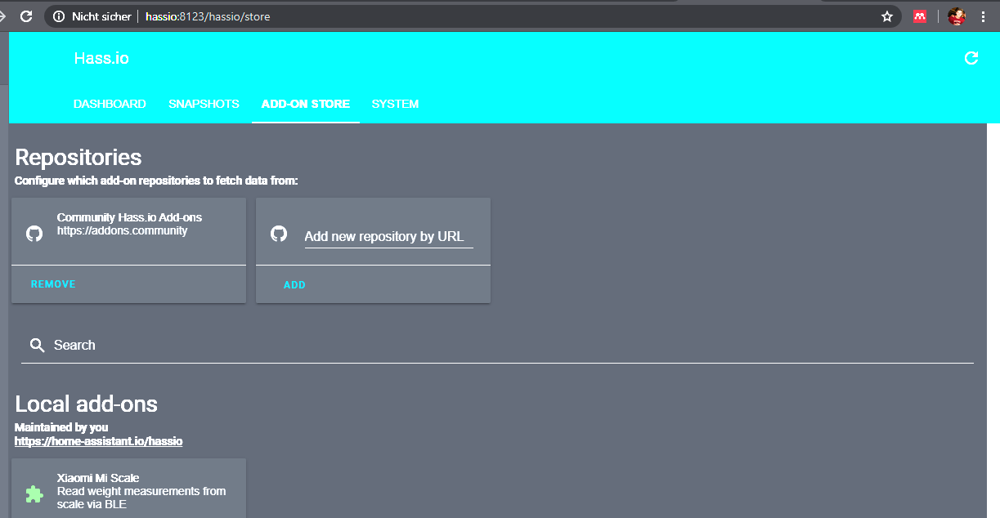

# Xiaomi Mi Scale

Hass.io addon that integrates the Xiaomi Body Composition Scale 1 and 2 into Home Assistant based on the original code from @lolouk44.


## Setup & Configuration

1. Retrieve the scale's MAC Address based on the Xiaomi Mi Fit app.

2. Download the addon
 
3. Create a new directory xiaomi_mi_scale in the folder addons in your hass.io installation and place all files in it (via SSH)


4. Adjust the Dockerfile according to your needs
```
# adjust here the environment variables
ENV MISCALE_MAC 00:00:00:00:00:00
ENV MQTT_PREFIX miScale
ENV MQTT_HOST 192.168.1.3
ENV MQTT_USERNAME username
ENV MQTT_PASSWORD password
ENV MQTT_PORT 1883
ENV MQTT_TIMEOUT 30
ENV USER1_GT 80
ENV USER1_SEX male
ENV USER1_NAME Tobias
ENV USER1_HEIGHT 186
ENV USER1_DOB 1990-01-01
ENV USER2_LT 70
ENV USER2_SEX female
ENV USER2_NAME Juliane
ENV USER2_HEIGHT 173
ENV USER2_DOB 1990-01-01
```

5. Open Hass.io and navigate to Hass.io -> add-on store and clock the reload button on the top right corner. Now you should see the Xiaomi Mi Scale as a local addon


6. Install the addon (takes a while as the container is built locally)

7. Start the addon

## Home-Assistant Setup:
Under the `sensor` block, enter as many blocks as users configured in your environment variables:

```yaml
  - platform: mqtt
    name: "Example Name Weight"
    state_topic: "miScale/USER_NAME/weight"
    value_template: "{{ value_json['Weight'] }}"
    unit_of_measurement: "kg"
    json_attributes_topic: "miScale/USER_NAME/weight"
    icon: mdi:scale-bathroom

  - platform: mqtt
    name: "Example Name BMI"
    state_topic: "miScale/USER_NAME/weight"
    value_template: "{{ value_json['BMI'] }}"
    icon: mdi:human-pregnant

```


